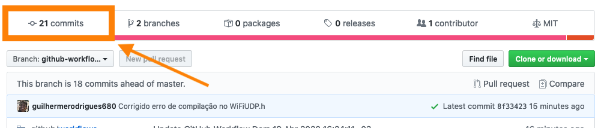

# Interligando NodeMCU e GoPro *(em desenvolvimento)*

    

## Descrição

Este projeto tem como objetivo ultilizar da comunicação Wireless TCP presente no ESP8266 para enviar 
requisições à API WI-FI da GoPro Hero 4 Silver e automatizar algum tipo de tarefa.  

### Dica

Esse projeto possui integração com o **GitHub Actions**, assim o Badge `"Compilação"` no topo deste README indica de forma automática se o código está sendo compilado com sucesso.  
Outra dica é navegar pelos commits e ver o retorno da compilação naquele momento, basta seguir os passos abaixo:  

    
     
    
     
    
     
    

### Links

@KonradIT: The unofficial API for GoPro cameras (The WiFi enabled models)  
[GoPro Wifi Hack](https://github.com/KonradIT/goprowifihack)